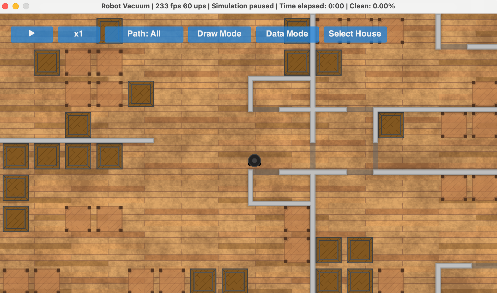
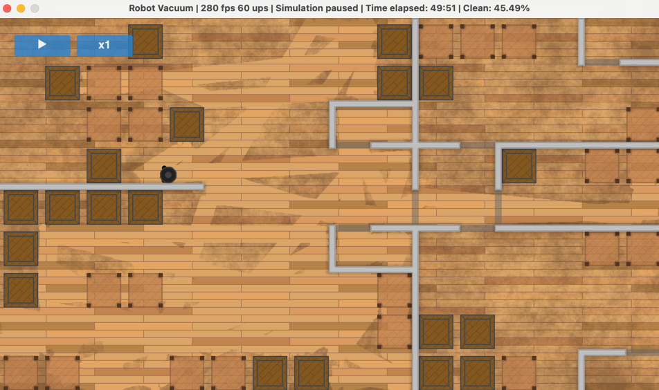

# Robo-Vacuum Simulator

Simulates a robot vacuum (iRobot etc.) cleaning a custom house

## Features:

- Multiple pathfinding algorithms
- Export multiple runs' data
- Multiple house layouts with different sizes and walls
- Customizable objects
- Impassible objects (crates) and passable objects (tables)
- Simulation speed control

## Example Screenshots

### Dirty:

### Cleaning:

 

##### _Originally created for CS 499 Senior Design at UAH_
